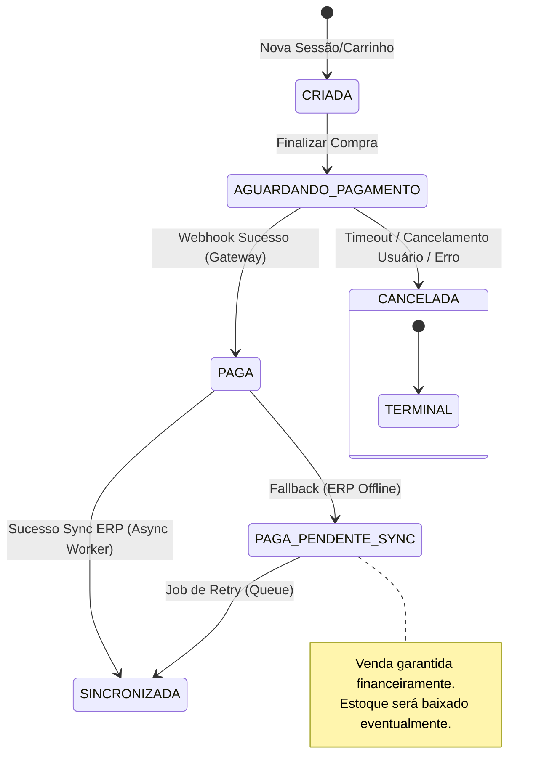
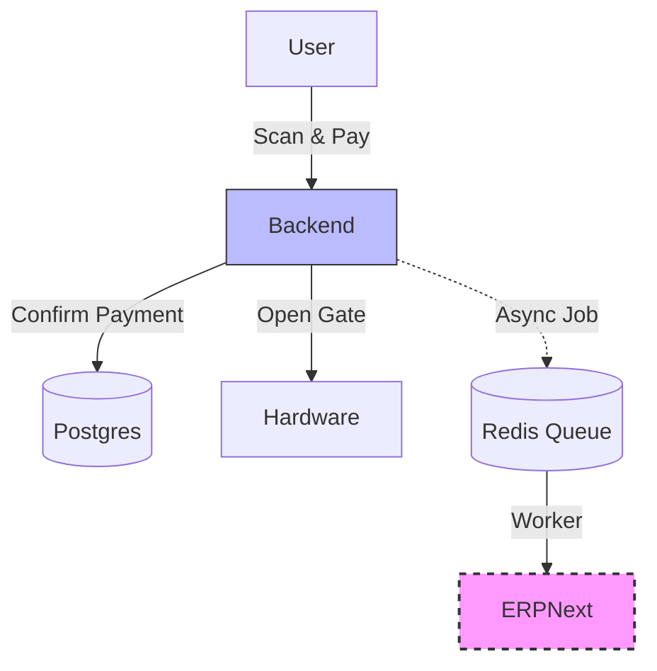

# Architecture & Critical Domain Design

This document defines the core contracts, state machines, and resilience strategies for the Autonomous Mini Market System. It serves as the blueprint for the backend and PDV implementation.

## 1. Sales State Machine (Máquina de Estados de Venda)
The sales flow is rigorous to ensure financial consistency. Transitions are strictly controlled.



### State Definitions
- **CRIADA**: Cart is open, user is scanning items. Price validation happens here.
- **AGUARDANDO_PAGAMENTO**: Cart locked. Payment intended (Pix Code generated). Stock tentatively reserved.
- **PAGA**: Payment confirmed by Gateway (Webhook). Access gate opens *here*. Transition to `SINCRONIZADA` happens via **Async Worker only**.
- **CANCELADA**: **Terminal state**. Order failed or timed out.
    - **INVARIANT**: Transitions to `CANCELADA` are **PROHIBITED** if current state is `PAGA` or later. Once paid, a sale clearly cannot be cancelled, only Refunded (new flow).
- **PAGA_PENDENTE_SYNC**: Payment confirmed, but ERPNext was unreachable or slow.
- **SINCRONIZADA**: Final consistency. Order registered in ERPNext.

---

## 2. Price Authority & Multi-Store Rule
Pricing is strictly scoped to the store unit to prevent cross-store data leaks or incorrect charges.

- **Store Scope**: Every sale session is strictly associated with a `storeId`.
- **Single Source of Truth**: The Backend (Orchestrator) is the ONLY authority for prices.
    - App and PDV **never** calculate totals locally. They display totals provided by the backend validation command.
- **Price Tables**: Each store has a unique price table.
    - Events must carry `priceTableVersion` to prove which price was active at the exact moment of scanning.

---

## 3. Event & Audit Model (Logs Imutáveis)
Every critical action generates an immutable audit log. These logs are the "source of truth" for debugging and legal defense.

### Event Schema (JSON Structure)
```typescript
interface AuditLog {
  eventId: string; // UUID v4
  timestamp: string; // ISO 8601
  actor: {
    userId: string;
    type: 'USER' | 'SYSTEM' | 'PDV' | 'GATEWAY';
    deviceId?: string;
  };
  action: string; 
  context: {
    sessionId: string;
    storeId: string;        // [NEW] Critical for multi-store context
    priceTableVersion?: string; // [NEW] Critical for financial audit
  };
  payload: Record<string, any>; 
  hash: string; // SHA-256(prev_event_hash + current_event_data) -> Blockchain-style chaining
}
```

### Critical Events List
- `SESSION_STARTED`
- `ITEM_SCANNED` (params: barcode, price_at_moment, store_id, price_version)
- `SALE_STATE_TRANSITION` (params: from_state, to_state, reason) **[CRITICAL]**
- `PAYMENT_INTENT_CREATED` (params: amount, gateway_id)
- `PAYMENT_CONFIRMED`
- `GATE_OPEN_COMMAND`
- `ERP_SYNC_FAILED`

---

## 4. Offline/Sync Strategy (PDV <-> Backend)
The PDV must operate autonomously if the internet fails, but with strict financial safety limits.

### Strict Rules
1.  **NO OFFLINE PAYMENTS**: Payments are **NEVER** initiated while PDV is offline.
2.  **Registration Only**: Offline mode is limited to registering items/building carts and syncing completed sales (recoveries) later.
3.  **Idempotency**: The sync endpoint must handle duplicate submissions gracefully using `offlineSaleId`.

### Sequence: Offline Safe
1.  **Detection**: PDV detects connectivity loss. Switches UI to "Mode: Offline".
    - Disables "Pay" button.
    - Allows checking prices (cached) or scanning for later.
2.  **Storage**: If a sale was theoretically completed (e.g. connectivity lost *after* payment but before confirmation logic), it saves to `OfflineQueue`.
3.  **Recovery**:
    - PDV detects connectivity.
    - Sends batch to `POST /sales/sync`.
    - Payload includes `offlineSaleId` (UUID generated at PDV).
    - Backend deduplicates using `offlineSaleId`.

---

## 5. Payment Idempotency & Webhooks
Prevent double charges and handle network race conditions.

- **Idempotency Key**: Generated at `PAYMENT_INTENT_CREATED`. Format: `ORDER_{SESSION_ID}_{UUID}` (Stronger uniqueness).
- **Webhook Handling**:
    1. Gateway calls `POST /webhooks/payment`.
    2. Backend verifies signature (HMAC).
    3. Backend checks Redis/DB: "Is this Order ID already processed?".
        - **Yes**: Return 200 OK immediately.
        - **No**: Process payment transition -> `PAGA`.
    4. **Fallback**: If backend is down during webhook, Gateway retries (exponential backoff).

---

## 6. ERPNext Isolation Pattern
The ERP is treated as a "Slow/Unreliable" downstream dependency. It is **never** in the hot path.

### Architecture
- **Pattern**: Asynchronous Queue (BullMQ / Redis).
- **Flow**:
    1. Sale Completed (Payment Confirmed).
    2. **IMMEDIATE**: Open Gate, Show Success UI.
    3. **ASYNC**: Add job `sync-sale-to-erp` to Queue.
- **Operational Safety**:
    - **Backlog Alert**: Trigger critical alert if `Pending Sync Queue > 50` items.
    - **SLA**: Dashboard must show sales pending sync > 24h.
    - **Failure Handling**:
        - Retries with exponential backoff.
        - DLQ (Dead Letter Queue) for unrecoverable errors.


